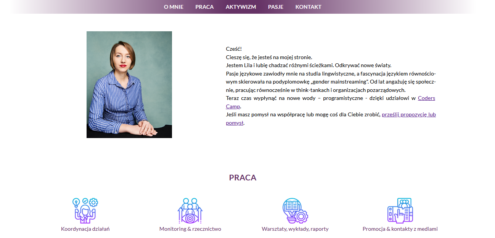

# Strona osobista - projekt wizytówki dla CodersCamp 2020
**Please scroll down for English** 

## Screen

## Opis projektu
Oto wizytówka stworzona w ramach pierwszego projektu Coders Camps, największego otwartego kursu programowania webowego. Moim zadaniem było stworzenie strony osobistej na bazie HTML5 i CSS3, bez użycia JavaScriptu i gotowych bibliotek. 

Zapraszam do korzystania i przebudowywania kodu na własne potrzeby. 

## Demo
[Live do strony](https://lilareliga.github.io/CodersCamp2020.Project.HTML-CSS.BusinessCard/)

## Elementy strony
Strona zawiera sekcje:
- O mnie
- Praca
- Aktywizm
- Pasje
- Kontakt

Docelowo strona będzie prezentować także moje programistyczne portfolio. 

W projekcie wykorzystałam znajomość:
- Box-model
- Kaskadowości i selektorów CSS
- Popularnych tagów HTML
- Stylowania tekstu, m.in. z podpięciem Google Fonts
- Flexboxa 
- CSS Grid
- Animacji keyframes
- Formularza (aby umożliwić wysyłanie wiadomości bez użycia JS czy innych frameworków, podpięłam formularz Google'a)
- Responsive Web Design 
Strona została sprawdzona na Web Developer Checklist i przetestowana na przeglądarkach: Chrome 87, IE 11, Edge 87, Firefox 84, Slimjet 28, and Opera LVL2 core v.72. 

## Business card - personal website made with HTML5 & CSS3
**Project for CodersCamp 2020** 
#### A single page, responsive business card which yoou can re-build as your own portfolio, personal site. This project was my first assignment during the Coders Camp, the biggest open coding bootcamp. The idea behind this site was to create a personal portfolio/business card using HTML and CSS only (no JavaScript).
The site consists of five sections:
- About me
- Work
- Activism
- Hobbies
- Contact
I intend to re-build it with upcoming front-end projects. 
Feel free to use for your purposes. 

## Demo
[Live demo](https://lilareliga.github.io/CodersCamp2020.Project.HTML-CSS.BusinessCard/)

## Features
- Flexbox 
- CSS Grid
- Animations
- Contact form (combined with Google Forms to make it work without JS)
- Responsive Web Design 

The site underwent cross-browser testing on Chrome 87, IE 11, Edge 87, Firefox 84, Slimjet 28, and Opera LVL2 core v.72.
It was also checked with Web Developer Checklist.

